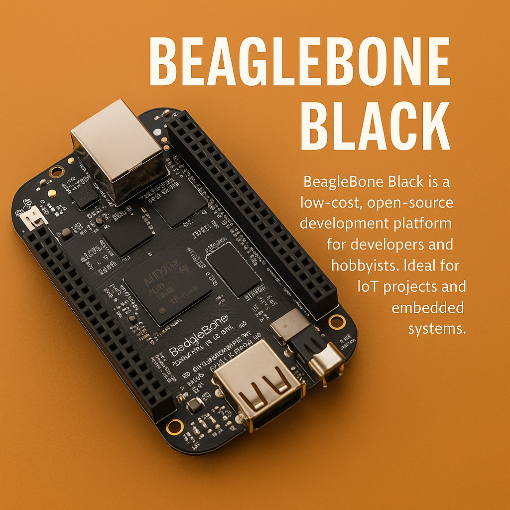
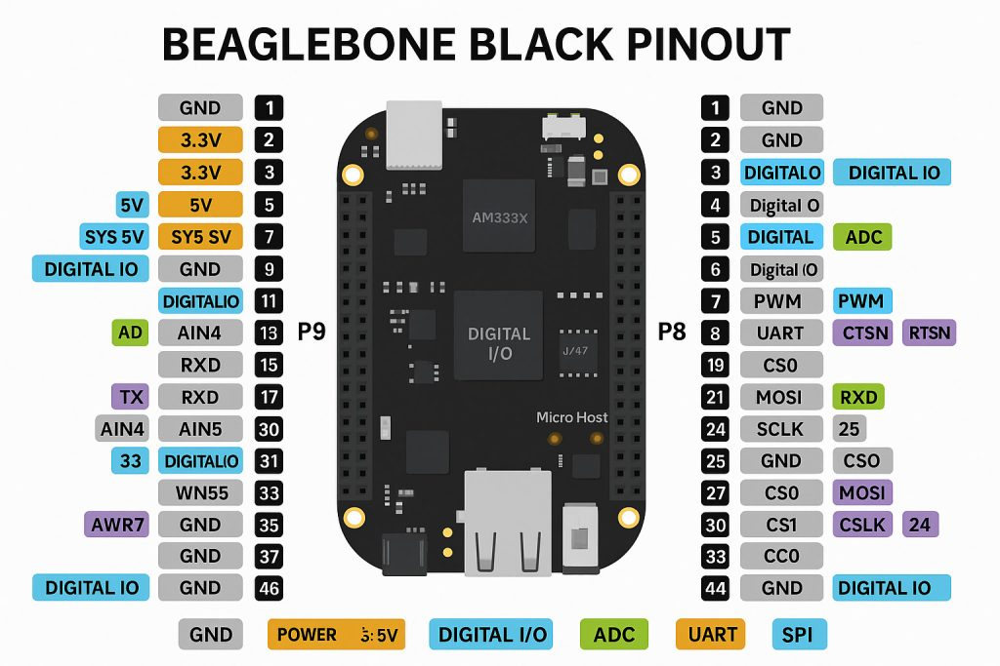

# YOCTO BEAGLEBONE BLACK TUTORIAL

 
 
 

BeagleBone Black is a low-cost, open-source development platform widely used in embedded systems and IoT applications. Backed by a strong community and designed by the BeagleBoard.org Foundation, this compact board provides a perfect balance of processing power, connectivity, GPIO flexibility, and real-time control.
 
 

<!---------------------------------------------------------------->
## What makes BeagleBone Black ideal in 2025?

Fast Linux boot (~10 seconds)
Strong GPIO and real-time processing via PRUs
Active community and wide  software compatibility
Perfect for industrial and academic IoT use
 
 

<!---------------------------------------------------------------->
## What Is BeagleBone Black?

BeagleBone Black is a  single-board computer (SBC) that runs full-fledged Linux distributions like Debian and Ubuntu, providing an ideal base for connected applications.

It’s part of the BeagleBoard family and uses the Texas Instruments Sitara AM335x 1GHz ARM Cortex-A8 processor, with an onboard GPU, 512MB DDR3 RAM, and 4GB eMMC storage.
 
 

<!---------------------------------------------------------------->
## Component	Specification
- Processor	TI Sitara AM335x ARM Cortex-A8 (1GHz)
- GPU	PowerVR SGX530 3D graphics accelerator
- RAM	512MB DDR3L @ 400MHz
- Storage	4GB eMMC onboard flash, microSD slot
- Real-Time Units (PRU)	2 × 32-bit PRUs for real-time processing
- Connectivity	Ethernet, USB Host & Client, Micro HDMI
- Expansion	2 x 46-pin headers (92 I/Os)
- Video Output	On-board HDMI with audio support
- Power Supply	USB or DC jack (5V)
- Boot Options	eMMC, microSD, USB
- Debug Interface	Optional JTAG via 20-pin CTI connector
 
 

<!---------------------------------------------------------------->
## Connectivity and I/O Capabilities
- Ethernet Port: 10/100 Mbps for local networks and IoT cloud connectivity
- USB Host and Client Ports: Peripheral and programming interfaces
- HDMI Output: Connects directly to monitors and TVs
- Serial UART: For debugging and interfacing with other devices
- GPIO, PWM, SPI, I2C, UART, ADC: All available via headers for full - embedded control
 
 

<!---------------------------------------------------------------->
## BeagleBone Black pinout

 
 

<!---------------------------------------------------------------->
## Supported Software and Operating Systems (2025)
BeagleBone Black supports a wide variety of open-source operating systems and development tools:

✅ Debian Linux (preloaded on eMMC) 
✅ Ubuntu Core (lightweight IoT-focused) 
✅ Android OS (for touchscreen-based interfaces) 
✅ Cloud9 IDE for in-browser coding with BoneScript 
✅ Docker + IoT SDKs (like AWS Greengrass, Azure IoT Edge) 
✅ Yocto Project (for custom Linux builds) 
✅ TensorFlow Lite (for AI at the edge) 